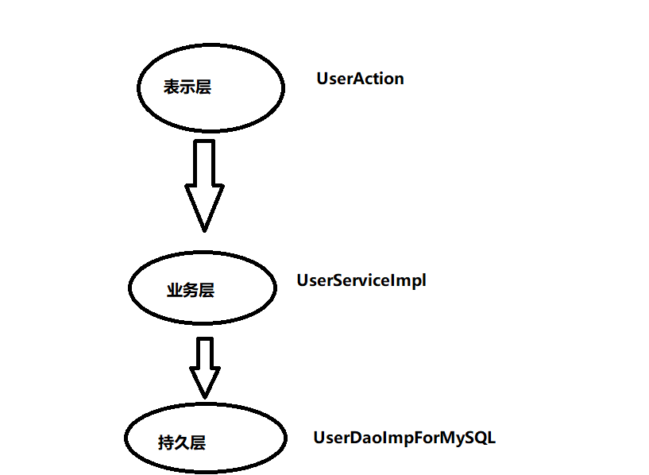

## DCP 
 **什么是DCP** 
> DCP 是软件七大开发原则当中最基本的一个原则，开闭原则:
> 对什么开： 对扩展开放
> 对什么闭: 对修改关闭
> **DCP原则是最核心的，最基本的，其他的六个原则都是为这个原则服务的** 

**DCP的开闭原则的核心是什么：**
> 只要你在扩展系统功能的时候，没有修改以前的写好的代码，那么你就是符合DCP原则的
> 反之，如果在扩展系统功能的时候，你修改了之前的代码，那么这个设计是失败的，违背DCP开闭原则
> 当进行系统功能的扩展的时候，如果动了之前的稳定的程序，修改了之前的程序，之前所有程序都需要进行重新测试
> ，这是不想看到的，因为非常的麻烦。

## 依赖倒置原则(DIP原则)

> UserAction依赖级具体的UserServiceImpl
> UserServiceImpl 依赖了具体的UserDaoImplForMySQL
~~~~java

public class Test {
    public static void main(String[] args) {
        UserService userService = new UserServiceImp();
        // UserService userService = new UserServiceImp();
        userService.deleteUser();

    }
}

public class UserServiceImp implements UserService {

    private UserDao userDao = new UserDaoImplForMySQL();

    @Override
    public void deleteUser() {
        userDao.deleteById();
    }
}

public class UserDaoImplForMySQL implements UserDao {

    @Override
    public void deleteById() {
        System.out.println("MySQL数据库正在删除数据");
    }
}

~~~~

> 目前来说：上是依赖下的：
> 凡是上依赖下，都违背了依赖倒置原则。
> 什么叫做符合依赖倒置原则，什么叫做遵守依赖倒置原则？
> 上不再依赖下了，表示符合倒置原则

**依赖倒置原则的核心是：倡导面向接口编程，面向抽象编程，不要面向具体编程
